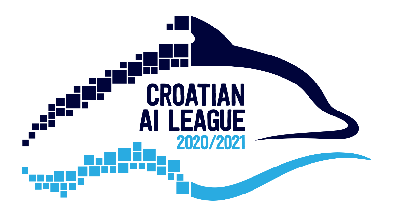

# Dolphins recognition challenge
> The challenge has two parts:




## Install

`pip install dolphins-recognition-challenge`

## How to use

```python
from dolphins_recognition_challenge.datasets import get_dataset

train_ds, val_ds = get_dataset("segmentation")

type(train_ds)
```


    torch.utils.data.dataloader.DataLoader


Please open this notebook in Colab to edit it and submit a solution:
    
[](https://colab.research.google.com/github/cro-ai-league/dolphins-recognition-challenge/blob/master/notebooks/00_Tutorial.ipynb)

## Sponsors

Here they go...

